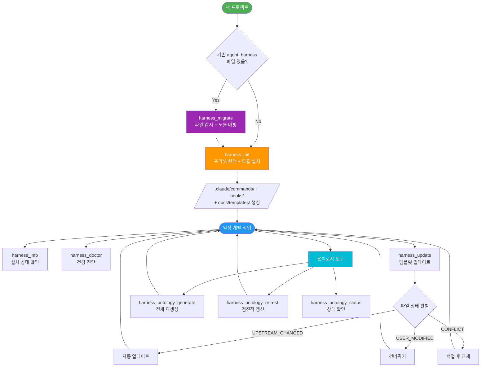
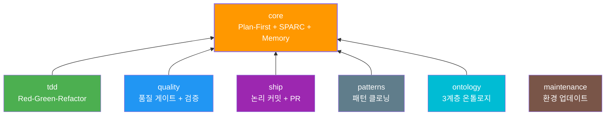
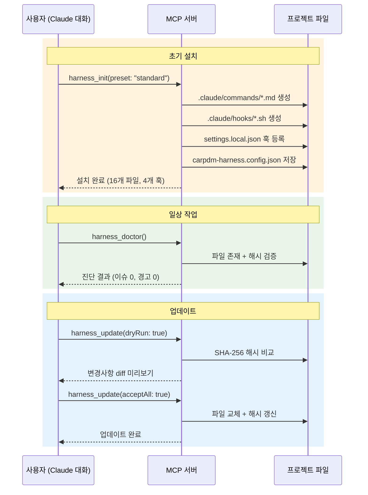

# carpdm-harness

AI 협업 워크플로우 MCP 서버 플러그인 — Plan-First + DDD + SPARC + External Memory

기존 `agent_harness`의 bash 기반 설치 방식을 **MCP(Model Context Protocol) 서버 플러그인**으로 전환하여, Claude 대화 중 직접 도구 호출로 **모듈화**, **버전 관리**, **diff 기반 업데이트**를 지원합니다.

## 설치

```bash
# Claude Code에 플러그인으로 등록
claude mcp add carpdm-harness node /path/to/carpdm-harness/dist/server.js

# 또는 .mcp.json을 프로젝트에 복사
cp /path/to/carpdm-harness/.mcp.json .
```

## 빠른 시작

Claude 대화 중 MCP 도구를 직접 호출합니다:

```
# standard 프리셋으로 설치
harness_init(projectRoot: "/path/to/project", preset: "standard")

# TDD 포함 설치
harness_init(projectRoot: "/path/to/project", preset: "tdd", enableOntology: true)

# 설치 상태 확인
harness_info(projectRoot: "/path/to/project")

# 건강 진단
harness_doctor(projectRoot: "/path/to/project")
```

## 워크플로우

### 전체 라이프사이클



### 모듈 의존성 구조



### init → 일상 워크플로우



## MCP 도구

| 도구 | 설명 |
|------|------|
| `harness_init` | 프로젝트에 워크플로우 설치 |
| `harness_update` | 설치된 템플릿 diff 기반 업데이트 |
| `harness_migrate` | 기존 agent_harness → carpdm-harness 전환 |
| `harness_list` | 모듈/프리셋 목록 표시 |
| `harness_info` | 현재 설치 상태 표시 |
| `harness_doctor` | 설치 건강 진단 |
| `harness_ontology_generate` | 온톨로지 전체 재생성 |
| `harness_ontology_refresh` | 변경된 파일만 점진적 갱신 |
| `harness_ontology_status` | 온톨로지 상태 표시 |

### harness_init 파라미터

| 파라미터 | 타입 | 기본값 | 설명 |
|---------|------|--------|------|
| `projectRoot` | string | (필수) | 프로젝트 루트 경로 |
| `preset` | string | `"standard"` | 프리셋 (full\|standard\|minimal\|tdd) |
| `modules` | string | - | 모듈 직접 지정 (쉼표 구분) |
| `installGlobal` | boolean | `true` | 글로벌 커맨드 설치 |
| `skipHooks` | boolean | `false` | 훅 등록 건너뛰기 |
| `dryRun` | boolean | `false` | 미리보기만 |
| `enableOntology` | boolean | `false` | 온톨로지 활성화 |

### harness_update 파라미터

| 파라미터 | 타입 | 기본값 | 설명 |
|---------|------|--------|------|
| `projectRoot` | string | (필수) | 프로젝트 루트 경로 |
| `module` | string | - | 특정 모듈만 업데이트 |
| `dryRun` | boolean | `false` | diff만 표시 |
| `acceptAll` | boolean | `false` | 모든 변경 자동 수락 |
| `refreshOntology` | boolean | `false` | 온톨로지 갱신 |

## 슬래시 커맨드

`harness_init` 실행 시 `~/.claude/commands/`에 글로벌 커맨드가 자동 설치됩니다. Claude Code에서 `/커맨드명`으로 사용합니다.

| 커맨드 | 설명 |
|--------|------|
| `/harness-init` | `harness_init` MCP 도구를 호출하여 워크플로우 설치 |
| `/harness-update` | `harness_update` MCP 도구를 호출하여 템플릿 업데이트 |
| `/project-setup` | 새 프로젝트에 AI 협업 환경 원스톱 구축 (플러그인 + MCP + 스킬 + 워크플로우) |
| `/project-init` | 기존 프로젝트에 AI 협업 환경 적용 (코드베이스 자동 분석) |
| `/project-setup-simple` | 초보자용 간소화 세팅 (4문항 인터뷰) |

## 모듈 시스템

7개 모듈로 구성되며, 각 모듈은 커맨드(`.claude/commands/`), 훅(`.claude/hooks/`), 문서 템플릿을 포함합니다.

| 모듈 | 설명 | 의존성 | 커맨드 | 훅 | 문서 |
|------|------|--------|--------|-----|------|
| **core** | Plan-First + SPARC + External Memory | 없음 | 3 | 3 | 4 |
| **tdd** | Red-Green-Refactor + 자동 차단 | core | 1 | 1 | 0 |
| **quality** | 품질 게이트 + 교차 검증 + 변경 추적 | core | 3 | 1 | 0 |
| **ship** | 논리 커밋 + PR 생성 | core | 2 | 0 | 0 |
| **maintenance** | 환경 업데이트 | 없음 | 1 | 0 | 0 |
| **patterns** | 패턴 클로닝 | core | 1 | 0 | 0 |
| **ontology** | 3계층 통합 온톨로지 (구조맵 + 시맨틱 + 도메인) | core | 2 | 1 | 1 |

## 프리셋

| 프리셋 | 모듈 | 설명 |
|--------|------|------|
| `standard` (추천) | core, quality, ship | 일반 프로젝트 |
| `full` | 전체 7개 | 완전한 워크플로우 (온톨로지 포함) |
| `tdd` | core, tdd, quality, ship | TDD 중심 |
| `minimal` | core | 최소 구성 |

## Update 흐름

`harness_update`는 파일별 SHA-256 해시를 비교하여 3가지 상태를 판별합니다:

- **UPSTREAM_CHANGED**: 사용자 미수정 + 템플릿 변경 → 자동 업데이트 후보
- **USER_MODIFIED**: 사용자 수정 + 템플릿 미변경 → 건너뛰기
- **CONFLICT**: 양쪽 모두 변경 → `acceptAll: true`로 백업 후 교체

```
harness_update(projectRoot: "/path/to/project")                    # 변경사항 확인
harness_update(projectRoot: "/path/to/project", acceptAll: true)   # 모든 변경 수락
harness_update(projectRoot: "/path/to/project", dryRun: true)      # diff만 미리보기
```

## 마이그레이션 (기존 agent_harness 사용자)

```
# 기존 파일 자동 감지 → 모듈 매핑
harness_migrate(projectRoot: "/path/to/project")

# 미리보기
harness_migrate(projectRoot: "/path/to/project", dryRun: true)
```

## 설정 파일

`carpdm-harness.config.json`이 프로젝트 루트에 생성되며, 설치 상태를 추적합니다:

```json
{
  "version": "1.0.0",
  "preset": "standard",
  "modules": ["core", "quality", "ship"],
  "files": {
    ".claude/commands/plan-gate.md": {
      "module": "core",
      "version": "1.0.0",
      "hash": "sha256:abc123..."
    }
  }
}
```

## 보호 파일

다음 파일/디렉토리는 절대 수정하거나 삭제하지 않습니다:

- `CLAUDE.md`
- `.agent/` 디렉토리 전체
- `.omc/` 디렉토리 전체
- `.mcp.json`

## 개발

```bash
git clone https://github.com/skdkfk8758/carpdm_harness.git
cd carpdm_harness
npm install
npm run build

# MCP Inspector로 테스트
npx @modelcontextprotocol/inspector node dist/server.js
```

## 라이센스

MIT
