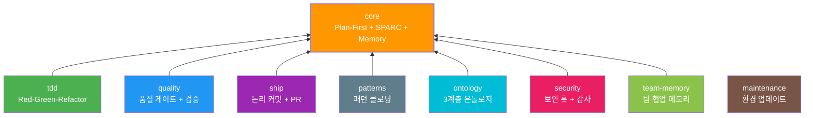
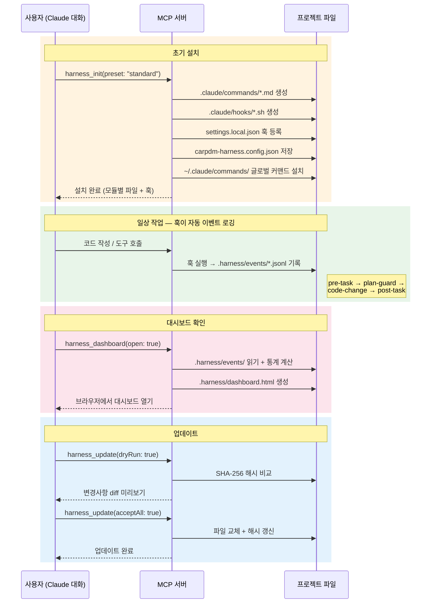
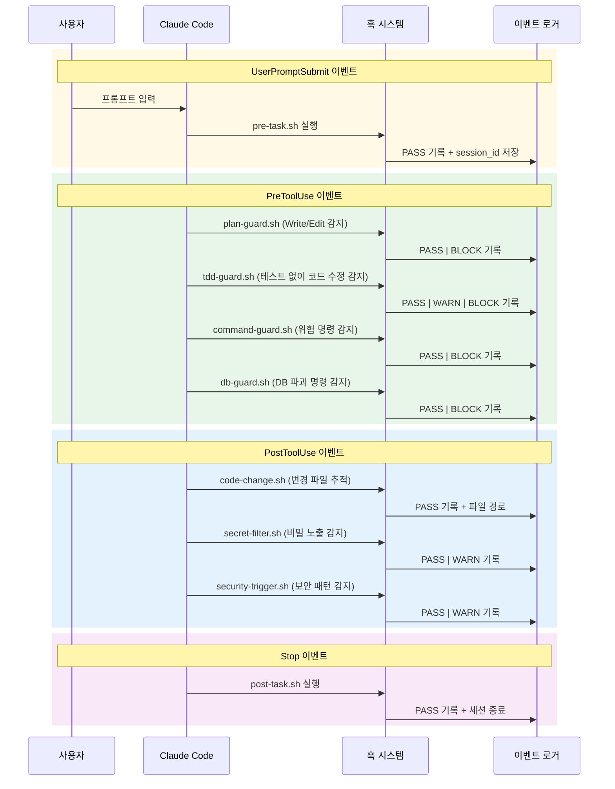
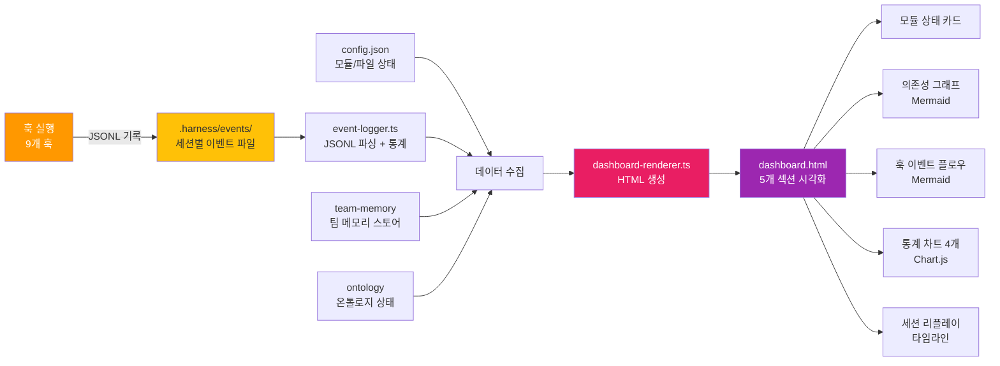

# carpdm-harness

AI 협업 워크플로우 MCP 서버 플러그인 — Plan-First + DDD + SPARC + External Memory

기존 `agent_harness`의 bash 기반 설치 방식을 **MCP(Model Context Protocol) 서버 플러그인**으로 전환하여, Claude 대화 중 직접 도구 호출로 **모듈화**, **버전 관리**, **diff 기반 업데이트**를 지원합니다.

---

## 목차

- [설치](#설치)
- [빠른 시작](#빠른-시작)
- [워크플로우](#워크플로우)
  - [전체 라이프사이클](#전체-라이프사이클)
  - [모듈 의존성 구조](#모듈-의존성-구조)
  - [init → 일상 워크플로우](#init--일상-워크플로우)
  - [훅 이벤트 플로우](#훅-이벤트-플로우)
  - [대시보드 워크플로우](#대시보드-워크플로우)
- [MCP 도구](#mcp-도구)
  - [harness_init 파라미터](#harness_init-파라미터)
  - [harness_update 파라미터](#harness_update-파라미터)
  - [harness_dashboard 파라미터](#harness_dashboard-파라미터)
- [슬래시 커맨드](#슬래시-커맨드)
- [모듈 시스템](#모듈-시스템)
- [프리셋](#프리셋)
- [이벤트 로깅 & 대시보드](#이벤트-로깅--대시보드)
  - [이벤트 수집 구조](#이벤트-수집-구조)
  - [대시보드 섹션](#대시보드-섹션)
- [Update 흐름](#update-흐름)
- [마이그레이션](#마이그레이션-기존-agent_harness-사용자)
- [설정 파일](#설정-파일)
- [보호 파일](#보호-파일)
- [개발](#개발)
- [라이센스](#라이센스)

---

## 설치

### 원라인 설치 (권장)

```bash
curl -fsSL https://raw.githubusercontent.com/skdkfk8758/carpdm_harness/main/install.sh | bash
```

### 수동 설치

```bash
git clone --depth 1 --branch v2.0.0 https://github.com/skdkfk8758/carpdm_harness.git ~/.claude/plugins/carpdm-harness
cd ~/.claude/plugins/carpdm-harness
npm install --production && npm run build
claude mcp add carpdm-harness -- node ~/.claude/plugins/carpdm-harness/dist/server.js
```

## 빠른 시작

Claude 대화 중 MCP 도구를 직접 호출합니다:

```
# standard 프리셋으로 설치
harness_init(projectRoot: "/path/to/project", preset: "standard")

# TDD 포함 설치
harness_init(projectRoot: "/path/to/project", preset: "tdd", enableOntology: true)

# 설치 상태 확인
harness_info(projectRoot: "/path/to/project")

# 건강 진단
harness_doctor(projectRoot: "/path/to/project")

# 대시보드 생성
harness_dashboard(projectRoot: "/path/to/project", open: true)
```

---

## 워크플로우

### 전체 라이프사이클

```mermaid
flowchart TD
    Start([새 프로젝트]) --> Migrate{기존 agent_harness<br/>파일 있음?}
    Migrate -->|Yes| MIG[harness_migrate<br/>파일 감지 + 모듈 매핑]
    Migrate -->|No| INIT

    MIG --> INIT[harness_init<br/>프리셋 선택 + 모듈 설치]
    INIT --> FILES[/.claude/commands/ + hooks/<br/>+ docs/templates/ + rules/ 생성]
    INIT --> GLOBAL[~/.claude/commands/<br/>글로벌 커맨드 8개 설치]

    FILES --> WORK([일상 개발 작업])
    GLOBAL --> WORK

    WORK --> INFO[harness_info<br/>설치 상태 확인]
    WORK --> DOCTOR[harness_doctor<br/>건강 진단]
    WORK --> UPDATE[harness_update<br/>템플릿 업데이트]
    WORK --> ONTO[온톨로지 도구]
    WORK --> DASH[harness_dashboard<br/>대시보드 생성]
    WORK --> MEM[harness_memory_add<br/>팀 메모리 관리]

    UPDATE --> DIFF{파일 상태 판별}
    DIFF -->|UPSTREAM_CHANGED| AUTO[자동 업데이트]
    DIFF -->|USER_MODIFIED| SKIP[건너뛰기]
    DIFF -->|CONFLICT| RESOLVE[백업 후 교체]

    AUTO --> WORK
    SKIP --> WORK
    RESOLVE --> WORK

    ONTO --> GEN[harness_ontology_generate<br/>전체 재생성]
    ONTO --> REF[harness_ontology_refresh<br/>점진적 갱신]
    ONTO --> STAT[harness_ontology_status<br/>상태 확인]
    ONTO --> DOM[harness_ontology_domain_write<br/>도메인 레이어 작성]
    GEN --> WORK
    REF --> WORK
    DOM --> WORK

    DASH --> HTML[.harness/dashboard.html<br/>브라우저에서 열기]

    style Start fill:#4CAF50,color:#fff
    style WORK fill:#2196F3,color:#fff
    style INIT fill:#FF9800,color:#fff
    style MIG fill:#9C27B0,color:#fff
    style ONTO fill:#00BCD4,color:#fff
    style DASH fill:#E91E63,color:#fff
    style MEM fill:#8BC34A,color:#fff
```

### 모듈 의존성 구조



### init → 일상 워크플로우



### 훅 이벤트 플로우

모든 훅은 실행 결과를 `.harness/events/` 디렉토리에 JSONL 형식으로 자동 기록합니다.



### 대시보드 워크플로우



---

## MCP 도구

| 도구 | 설명 |
|------|------|
| `harness_init` | 프로젝트에 워크플로우 설치 |
| `harness_update` | 설치된 템플릿 diff 기반 업데이트 |
| `harness_migrate` | 기존 agent_harness → carpdm-harness 전환 |
| `harness_list` | 모듈/프리셋 목록 표시 |
| `harness_info` | 현재 설치 상태 표시 |
| `harness_doctor` | 설치 건강 진단 |
| `harness_dashboard` | 워크플로우 대시보드 생성 (이벤트 통계 + 모듈 상태 + 세션 리플레이) |
| `harness_ontology_generate` | 온톨로지 전체 재생성 |
| `harness_ontology_refresh` | 변경된 파일만 점진적 갱신 |
| `harness_ontology_status` | 온톨로지 상태 표시 |
| `harness_ontology_domain_write` | 온톨로지 도메인 레이어 작성 |
| `harness_memory_add` | 팀 메모리에 항목 추가 |
| `harness_memory_list` | 팀 메모리 항목 조회 |

### harness_init 파라미터

| 파라미터 | 타입 | 기본값 | 설명 |
|---------|------|--------|------|
| `projectRoot` | string | (필수) | 프로젝트 루트 경로 |
| `preset` | string | `"standard"` | 프리셋 (full\|standard\|minimal\|tdd\|secure) |
| `modules` | string | - | 모듈 직접 지정 (쉼표 구분) |
| `installGlobal` | boolean | `true` | 글로벌 커맨드 설치 |
| `skipHooks` | boolean | `false` | 훅 등록 건너뛰기 |
| `dryRun` | boolean | `false` | 미리보기만 |
| `enableOntology` | boolean | `false` | 온톨로지 활성화 |

### harness_update 파라미터

| 파라미터 | 타입 | 기본값 | 설명 |
|---------|------|--------|------|
| `projectRoot` | string | (필수) | 프로젝트 루트 경로 |
| `module` | string | - | 특정 모듈만 업데이트 |
| `dryRun` | boolean | `false` | diff만 표시 |
| `acceptAll` | boolean | `false` | 모든 변경 자동 수락 |
| `refreshOntology` | boolean | `false` | 온톨로지 갱신 |

### harness_dashboard 파라미터

| 파라미터 | 타입 | 기본값 | 설명 |
|---------|------|--------|------|
| `projectRoot` | string | (필수) | 프로젝트 루트 경로 |
| `sessionId` | string | - | 특정 세션 ID (생략 시 전체) |
| `open` | boolean | `false` | 생성 후 브라우저에서 열기 |

---

## 슬래시 커맨드

`harness_init` 실행 시 `~/.claude/commands/`에 글로벌 커맨드가 자동 설치됩니다. Claude Code에서 `/커맨드명`으로 사용합니다.

| 커맨드 | 설명 |
|--------|------|
| `/harness-init` | `harness_init` MCP 도구를 호출하여 워크플로우 설치 |
| `/harness-update` | `harness_update` MCP 도구를 호출하여 템플릿 업데이트 |
| `/harness-list` | `harness_list` MCP 도구를 호출하여 모듈/프리셋 목록 조회 |
| `/dashboard` | `harness_dashboard` MCP 도구로 대시보드 생성 + 브라우저 열기 |
| `/project-setup` | 새 프로젝트에 AI 협업 환경 원스톱 구축 (플러그인 + MCP + 스킬 + 워크플로우) |
| `/project-init` | 기존 프로젝트에 AI 협업 환경 적용 (코드베이스 자동 분석) |
| `/project-setup-simple` | 초보자용 간소화 세팅 (4문항 인터뷰) |
| `/workflow-guide` | 모듈 조합 워크플로우 가이드 (7가지 파이프라인) |
| `/ship-release` | PR 머지 + 버전 bump + GitHub Release 생성 |

---

## 모듈 시스템

9개 모듈로 구성되며, 각 모듈은 커맨드(`.claude/commands/`), 훅(`.claude/hooks/`), 문서 템플릿, 규칙(`.claude/rules/`), 에이전트(`.claude/agents/`)를 포함합니다.

| 모듈 | 설명 | 의존성 | 커맨드 | 훅 | 문서 | 규칙 | 에이전트 |
|------|------|--------|--------|-----|------|------|----------|
| **core** | Plan-First + SPARC + External Memory | 없음 | 3 | 4 | 4 | - | - |
| **tdd** | Red-Green-Refactor + 자동 차단 | core | 1 | 1 | - | - | - |
| **quality** | 품질 게이트 + 교차 검증 + 변경 추적 | core | 5 | 1 | - | - | - |
| **ship** | 논리 커밋 + PR 생성 + 릴리스 | core | 3 | - | - | - | - |
| **maintenance** | 환경 업데이트 | 없음 | 1 | - | - | - | - |
| **patterns** | 패턴 클로닝 | core | 1 | - | - | - | - |
| **ontology** | 3계층 온톨로지 (구조맵 + 시맨틱 + 도메인) | core | 2 | 1 | 1 | - | - |
| **security** | 보안 훅 + 감사 + 권한 관리 | core | 2 | 4 | - | - | - |
| **team-memory** | 팀 협업 메모리 + 공유 규칙 + 학습 에이전트 | core | 1 | - | 1 | 4 | 1 |

---

## 프리셋

| 프리셋 | 모듈 | 설명 |
|--------|------|------|
| `standard` (추천) | core, quality, ship | 일반 프로젝트 |
| `full` | 전체 9개 | 완전한 워크플로우 (보안 + 온톨로지 + 팀 메모리 포함) |
| `tdd` | core, tdd, quality, ship | TDD 중심 |
| `minimal` | core | 최소 구성 |
| `secure` | core, quality, security, ship | 보안 중심 |

---

## 이벤트 로깅 & 대시보드

harness의 모든 훅은 실행 시 이벤트를 `.harness/events/` 디렉토리에 JSONL 형식으로 자동 기록합니다. 이 데이터를 기반으로 인터랙티브 HTML 대시보드를 생성할 수 있습니다.

### 이벤트 수집 구조

```
프로젝트/
└── .harness/
    └── events/
        ├── abc123.jsonl      ← 세션별 이벤트 파일
        ├── def456.jsonl
        └── ...
```

각 이벤트는 아래 형식의 JSON 한 줄:

```json
{"ts":"2026-02-24T10:30:00Z","session":"abc123","event":"PreToolUse","hook":"plan-guard","result":"PASS","tool":"Write","file":"src/main.ts"}
```

| 필드 | 설명 |
|------|------|
| `ts` | UTC 타임스탬프 |
| `session` | 세션 ID |
| `event` | Claude Code 이벤트 (UserPromptSubmit, PreToolUse, PostToolUse, Stop) |
| `hook` | 실행된 훅 이름 (pre-task, plan-guard, tdd-guard 등) |
| `result` | 실행 결과 (PASS, WARN, BLOCK) |
| `tool` | 관련 도구명 (선택) |
| `file` | 관련 파일 경로 (선택) |

### 대시보드 섹션

`harness_dashboard` 또는 `/dashboard` 명령으로 생성되는 HTML 대시보드는 5개 섹션으로 구성됩니다:

| # | 섹션 | 내용 | 시각화 |
|---|------|------|--------|
| 1 | **모듈 상태 현황** | 설치 모듈, 파일 무결성, 팀 메모리, 온톨로지 | CSS Grid 카드 |
| 2 | **모듈 의존성 그래프** | 모듈 간 의존 관계 | Mermaid 플로우차트 |
| 3 | **훅 이벤트 플로우** | 이벤트 → 훅 실행 흐름 | Mermaid 시퀀스 다이어그램 |
| 4 | **통계 대시보드** | 훅 빈도, PASS/WARN/BLOCK 비율, 시간대별 활동, Top 변경 파일 | Chart.js 차트 4개 |
| 5 | **세션 리플레이** | 세션별 이벤트 타임라인 (색상: PASS=초록, WARN=노랑, BLOCK=빨강) | 인터랙티브 타임라인 |

---

## 릴리스 파이프라인

코드 변경부터 릴리스까지의 전체 워크플로우:

```
/logical-commit → /ship-pr → /ship-release
(변경 분류+커밋)  (브랜치+PR)  (머지+태그+Release)
```

| 단계 | 커맨드 | 동작 |
|------|--------|------|
| 1. 커밋 | `/logical-commit` | 변경사항을 논리 단위로 분류하여 커밋 |
| 2. PR | `/ship-pr` | feature 브랜치 생성 + PR 올리기 |
| 3. 릴리스 | `/ship-release` | PR 머지 + 버전 bump + GitHub Release |

### 다른 프로젝트 업데이트

릴리스 후 다른 프로젝트에서는 세션 시작 시 자동으로 업데이트가 감지됩니다:

```
세션 시작 → update-check.sh → 최신 태그 감지 → harness_update(updatePlugin: true)
```

---

## Update 흐름

`harness_update`는 파일별 SHA-256 해시를 비교하여 3가지 상태를 판별합니다:

- **UPSTREAM_CHANGED**: 사용자 미수정 + 템플릿 변경 → 자동 업데이트 후보
- **USER_MODIFIED**: 사용자 수정 + 템플릿 미변경 → 건너뛰기
- **CONFLICT**: 양쪽 모두 변경 → `acceptAll: true`로 백업 후 교체

```
harness_update(projectRoot: "/path/to/project")                    # 변경사항 확인
harness_update(projectRoot: "/path/to/project", acceptAll: true)   # 모든 변경 수락
harness_update(projectRoot: "/path/to/project", dryRun: true)      # diff만 미리보기
```

## 마이그레이션 (기존 agent_harness 사용자)

```
# 기존 파일 자동 감지 → 모듈 매핑
harness_migrate(projectRoot: "/path/to/project")

# 미리보기
harness_migrate(projectRoot: "/path/to/project", dryRun: true)
```

## 설정 파일

`carpdm-harness.config.json`이 프로젝트 루트에 생성되며, 설치 상태를 추적합니다:

```json
{
  "version": "1.0.0",
  "preset": "standard",
  "modules": ["core", "quality", "ship"],
  "files": {
    ".claude/commands/plan-gate.md": {
      "module": "core",
      "version": "1.0.0",
      "hash": "sha256:abc123..."
    }
  }
}
```

## 보호 파일

다음 파일/디렉토리는 절대 수정하거나 삭제하지 않습니다:

- `CLAUDE.md`
- `.agent/` 디렉토리 전체
- `.omc/` 디렉토리 전체
- `.mcp.json`

## 개발

```bash
git clone https://github.com/skdkfk8758/carpdm_harness.git
cd carpdm_harness
npm install
npm run build

# MCP Inspector로 테스트
npx @modelcontextprotocol/inspector node dist/server.js
```

## 라이센스

MIT
