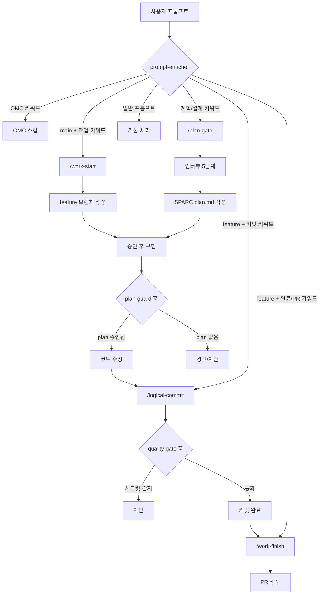

# carpdm-harness

AI 협업 워크플로우 플러그인 — Plan-First + DDD + SPARC + TRUST 5 + Workflow Engine

Claude Code 플러그인으로 설치하여 AI 협업 워크플로우(모듈화, 온톨로지, 품질 게이트, 워크플로우 엔진, 팀 메모리)를 프로젝트에 적용합니다. [oh-my-claudecode (OMC)](https://github.com/nicobailon/oh-my-claudecode) 통합으로 멀티 에이전트 오케스트레이션을 지원합니다.

---

## 목차

- [설치](#설치)
- [빠른 시작](#빠른-시작)
- [MCP 도구](#mcp-도구)
- [TRUST 5 품질 게이트](#trust-5-품질-게이트)
- [워크플로우 엔진](#워크플로우-엔진)
- [훅 시스템](#훅-시스템)
- [온톨로지 & @MX 어노테이션](#온톨로지--mx-어노테이션)
- [모듈 시스템](#모듈-시스템)
- [프리셋](#프리셋)
- [스킬 & 에이전트](#스킬--에이전트)
- [개발](#개발)
- [라이센스](#라이센스)

---

## Quick Start

### Step 1: Install

```
/plugin marketplace add https://github.com/skdkfk8758/carpdm_harness
/plugin install carpdm-harness@carpdm
```

### Step 2: Setup

```
/carpdm-harness:setup
```

### Step 3: Start Working

```
/carpdm-harness:workflow start feature
```

> Claude Code를 재시작하면 스킬과 MCP 도구가 활성화됩니다.

---

## 수동 설치

```bash
git clone --depth 1 https://github.com/skdkfk8758/carpdm_harness.git ~/.claude/plugins/carpdm-harness
cd ~/.claude/plugins/carpdm-harness
npm install --production && npm run build
```

---

## 주요 명령어

```
/carpdm-harness:setup              # OMC 검증 + 환경 셋업
/carpdm-harness:init               # 프로젝트에 워크플로우 설치
/carpdm-harness:quality-check      # TRUST 5 품질 검사
/carpdm-harness:workflow            # 워크플로우 관리
/carpdm-harness:doctor             # 설치 건강 진단
/carpdm-harness:dashboard          # 대시보드 생성
```

---

## MCP 도구

22개 MCP 도구를 제공합니다.

### 핵심 도구

| 도구 | 설명 |
|------|------|
| `harness_init` | 프로젝트에 워크플로우 설치 |
| `harness_setup` | OMC 검증 + 외부 도구 감지 + 프리셋 추천 |
| `harness_update` | 설치된 템플릿 diff 기반 업데이트 |
| `harness_migrate` | 기존 agent_harness → carpdm-harness 전환 |
| `harness_list` | 모듈/프리셋 목록 표시 |
| `harness_info` | 현재 설치 상태 표시 |
| `harness_doctor` | 설치 건강 진단 (OMC 포함) |
| `harness_dashboard` | 워크플로우 대시보드 생성 |
| `harness_sync` | 양방향 상태 동기화 (harness ↔ OMC) |

### 품질 & 워크플로우

| 도구 | 설명 |
|------|------|
| `harness_quality_check` | TRUST 5 품질 게이트 검사 |
| `harness_workflow` | 워크플로우 실행 엔진 (11개 액션) |

### 온톨로지

| 도구 | 설명 |
|------|------|
| `harness_ontology_generate` | 온톨로지 전체 재생성 |
| `harness_ontology_refresh` | 변경된 파일만 점진적 갱신 |
| `harness_ontology_status` | 온톨로지 상태 표시 |
| `harness_ontology_domain_write` | 도메인 레이어 작성 |
| `harness_ontology_annotations` | @MX 어노테이션 조회/필터링 |

### 팀 메모리

| 도구 | 설명 |
|------|------|
| `harness_memory_add` | 팀 메모리에 항목 추가 |
| `harness_memory_list` | 팀 메모리 항목 조회 |
| `harness_bug_report` | 버그 기록 + GitHub Issue 생성 |
| `harness_github_setup` | GitHub 라벨 자동 생성 (20개 표준 라벨) |

### 검증

| 도구 | 설명 |
|------|------|
| `harness_manage_verify` | 검증 항목 관리 (추가/삭제/조회) |
| `harness_verify_all` | 전체 검증 항목 일괄 실행 |

---

## TRUST 5 품질 게이트

5개 품질 기준으로 코드 품질을 자동 검증합니다. 각 기준은 `block` / `warn` / `off` 3단계로 설정 가능합니다.

| 기준 | 검증 내용 |
|------|-----------|
| **Tested** | 테스트 파일 존재, 테스트 명령 실행, 커버리지 힌트, TDD 순서 |
| **Readable** | 린트 에러, 파일/함수 길이, TODO/FIXME, 네이밍 |
| **Unified** | 포맷팅, 임포트 순서, 프로젝트 구조 일관성 |
| **Secured** | 시크릿 패턴, eval/exec 사용, SQL 인젝션 |
| **Trackable** | Conventional Commits, 이슈 참조, 브랜치 네이밍 |

`git commit` 감지 시 PostToolUse 훅이 자동으로 Secured + Trackable 경량 검증을 실행합니다.

---

## 워크플로우 엔진

6-상태 FSM (Finite State Machine) 기반 워크플로우 실행 엔진입니다.

### 상태 전이

```
idle → running → waiting_checkpoint → completed
                ↓                    ↑
           failed_step ──→ (retry) ──┘
                ↓
             aborted
```

### 지원 워크플로우

| 타입 | 설명 |
|------|------|
| `feature` | 기능 개발 (설계 → 구현 → 테스트 → 리뷰 → 머지) |
| `bugfix` | 버그 수정 (재현 → 분석 → 수정 → 검증) |
| `refactor` | 리팩토링 (분석 → 설계 → 구현 → 검증) |
| `release` | 릴리스 (준비 → 테스트 → 태그 → 배포) |
| `security` | 보안 (스캔 → 분석 → 수정 → 검증) |

### 액션 (11개)

`guide` | `start` | `advance` | `status` | `approve` | `reject` | `retry` | `skip` | `abort` | `list` | `history`

---

## 워크플로우 자동화

사용자 프롬프트만으로 전체 워크플로우가 자동 트리거됩니다. 슬래시 커맨드 없이도 동작합니다.

### 프롬프트 → 워크플로우 매핑



### 자동 감지 키워드

| 키워드 | 트리거 스킬 | 조건 |
|--------|-------------|------|
| "계획 세워줘", "설계해줘", "플래닝", "인터뷰 시작", "SPARC" | `/plan-gate` | 브랜치 무관 |
| "작업 시작", "work start", "새 작업" | `/work-start` | main 브랜치 |
| 이슈번호(#N) + 코딩 동사 | `/work-start` | main 브랜치 |
| "작업 완료", "PR 올려", "create PR" | `/work-finish` | feature 브랜치 |
| "커밋해줘", "logical commit" | `/logical-commit` | feature 브랜치 |
| "ship", "머지", "release" | `/work-finish` (제안) | feature 브랜치 |
| 코딩 동사 ("구현해줘", "추가해줘") | `/work-start` (제안) | main 브랜치 |

---

## 훅 시스템

9개 이벤트에 걸쳐 11개 훅이 등록됩니다.

| 이벤트 | 훅 | 역할 |
|--------|-----|------|
| SessionStart | session-start | 세션 초기화 + 환경 감지 |
| UserPromptSubmit | prompt-enricher | OMC 키워드 감지 + 워크플로우 상태 요약 |
| SubagentStart | subagent-context | 워크플로우 단계 컨텍스트 주입 |
| PreToolUse | workflow-guard (x2) | 워크플로우/harness 도구 가드 |
| PostToolUse | event-logger | harness 도구 이벤트 로깅 |
| PostToolUse | quality-gate | git commit 감지 → TRUST 검증 |
| PostToolUse | remember-handler | Task 응답의 `<remember>` 태그 → notepad 자동 저장 |
| PostToolUseFailure | tool-failure-tracker | 도구 실패 추적 + 재시도 카운트 |
| SubagentStop | subagent-complete | 완료 이벤트 로깅 + 다음 단계 힌트 |
| PreCompact | pre-compact | 컴팩션 전 워크플로우/메모리 보존 |
| Stop | session-end | 세션 종료 처리 + OMC 모드 영속 |

---

## 온톨로지 & @MX 어노테이션

3계층 온톨로지에 @MX 어노테이션이 통합됩니다.

### @MX 태그

| 태그 | 생성 방식 | 기준 |
|------|-----------|------|
| `ANCHOR` | 자동 | fan_in >= 3 (많이 참조되는 심볼) |
| `WARN` | 자동 | 순환복잡도 높음 / 파일 크기 초과 |
| `NOTE` | 수동 | 기존 주석의 @MX 태그 스캔 |
| `TODO` | 자동 | TODO/FIXME/HACK 주석 스캔 |

온톨로지 생성/갱신 시 자동으로 @MX 분석이 실행되며, `harness_ontology_annotations` 도구로 태그/파일 필터링 조회가 가능합니다.

---

## 모듈 시스템

9개 모듈로 구성됩니다.

| 모듈 | 설명 | 의존성 |
|------|------|--------|
| **core** | Plan-First + SPARC + External Memory | 없음 |
| **tdd** | Red-Green-Refactor + 자동 차단 | core |
| **quality** | 품질 게이트 + TRUST 5 + 교차 검증 | core |
| **ship** | 논리 커밋 + PR 생성 + 릴리스 | core |
| **maintenance** | 환경 업데이트 | 없음 |
| **patterns** | 패턴 클로닝 | core |
| **ontology** | 3계층 온톨로지 + @MX 어노테이션 | core |
| **security** | 보안 훅 + 감사 + 권한 관리 | core |
| **team-memory** | 팀 협업 메모리 + 공유 규칙 | core |

---

## 프리셋

| 프리셋 | 모듈 | 설명 |
|--------|------|------|
| `standard` (추천) | core, quality, ship | 일반 프로젝트 |
| `full` | 전체 9개 | 완전한 워크플로우 |
| `tdd` | core, tdd, quality, ship | TDD 중심 |
| `secure` | core, quality, security, ship | 보안 중심 |

---

## 스킬 & 에이전트

### 스킬 (26개)

플러그인 설치 시 `skills/` 디렉토리의 스킬이 자동 등록됩니다. MCP 도구 호출을 안내하는 래퍼 스킬입니다.

### 에이전트 (10개)

| 에이전트 | 역할 |
|----------|------|
| `workflow-guide` | 워크플로우 카탈로그 + 선택 가이드 |
| `onboarding-guide` | 신규 프로젝트 온보딩 |
| `team-memory-keeper` | 팀 메모리 관리 + 학습 |
| `pipeline-advisor` | 파이프라인 최적화 조언 |
| `code-reviewer` | TRUST 5 기반 코드 리뷰 |
| `quality-auditor` | 프로젝트 품질 심층 감사 |
| `security-scanner` | OWASP + 시크릿 보안 스캔 |
| `ontology-analyst` | 온톨로지 기반 아키텍처 분석 |
| `refactor-planner` | 안전한 리팩토링 계획 수립 |
| `debug-assistant` | 근본 원인 분석 + 디버그 보조 |

---

## 개발

```bash
git clone https://github.com/skdkfk8758/carpdm_harness.git
cd carpdm_harness
npm install
npm run build          # tsup (13 entries) + copy-templates
npx tsc --noEmit       # 타입 체크
npx vitest run         # 테스트 (255 tests)

# MCP Inspector
npx @modelcontextprotocol/inspector node dist/server.js

# 릴리스
bash scripts/release.sh patch
```

---

## 라이센스

MIT
