# carpdm-harness 워크플로우 가이드

> 다른 프로젝트에 플러그인으로 설치했을 때 사용할 수 있는 모든 워크플로우를 시각화와 함께 설명합니다.

---

## 목차

- [시스템 아키텍처 개요](#시스템-아키텍처-개요)
- [진입 경로](#진입-경로)
- [프리셋 & 모듈](#프리셋--모듈)
- [워크플로우 파이프라인](#워크플로우-파이프라인)
- [라이프사이클 훅](#라이프사이클-훅)
- [스킬 (Slash Commands)](#스킬-slash-commands)
- [MCP 도구 (harness_*)](#mcp-도구-harness_)
- [에이전트](#에이전트)
- [온톨로지 시스템](#온톨로지-시스템)
- [팀 메모리 시스템](#팀-메모리-시스템)
- [실전 시나리오](#실전-시나리오)

---

## 시스템 아키텍처 개요

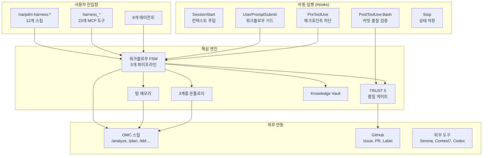

---

## 진입 경로

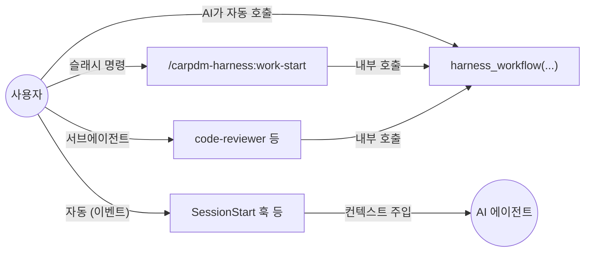

| 경로 | 형식 | 호출 주체 | 예시 |
|------|------|-----------|------|
| **Skills** | `/carpdm-harness:<name>` | 사용자 직접 | `/carpdm-harness:work-start feat/#123` |
| **MCP Tools** | `harness_<name>({ ... })` | AI 또는 스킬 내부 | `harness_workflow({ action: "advance" })` |
| **Agents** | 서브에이전트 이름 | AI 자동 위임 | `code-reviewer`, `debug-assistant` |
| **Hooks** | 이벤트 자동 트리거 | 시스템 | SessionStart, git commit 시 |

---

## 프리셋 & 모듈

### 프리셋 선택 가이드

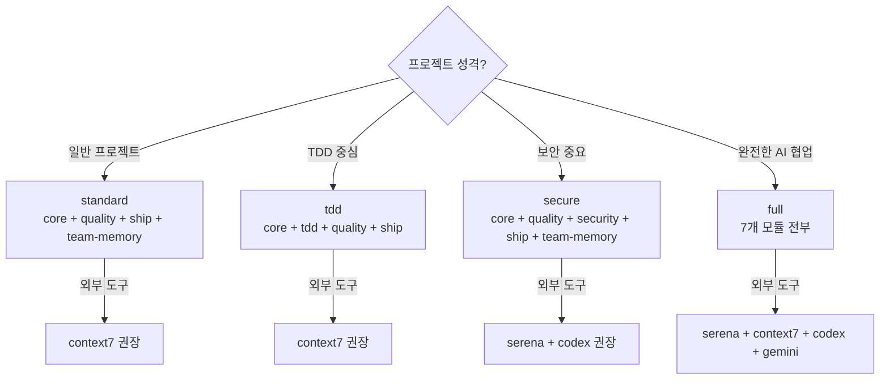

### 7개 모듈 구성

```
┌─────────────────────────────────────────────────────────┐
│                      full 프리셋                         │
│  ┌──────────────────────────────────────────────────┐   │
│  │               standard 프리셋                      │   │
│  │  ┌──────────┐ ┌──────────┐ ┌──────┐ ┌──────────┐│   │
│  │  │   core   │ │ quality  │ │ ship │ │team-memory││   │
│  │  │ 14 cmds  │ │ 10 cmds  │ │5 cmds│ │ 5 rules  ││   │
│  │  │ Plan-    │ │ TRUST 5  │ │커밋  │ │ 팀 지식   ││   │
│  │  │ First    │ │ 품질     │ │PR    │ │ 공유      ││   │
│  │  │ SPARC    │ │ 게이트   │ │릴리스│ │           ││   │
│  │  └──────────┘ └──────────┘ └──────┘ └──────────┘│   │
│  └──────────────────────────────────────────────────┘   │
│  ┌──────────┐  ┌──────────┐  ┌──────────┐              │
│  │   tdd    │  │ ontology │  │ security │              │
│  │ 1 cmd    │  │ 2 cmds   │  │ 2 cmds   │              │
│  │ Red-     │  │ 3계층    │  │ 보안 훅  │              │
│  │ Green-   │  │ @MX      │  │ 감사     │              │
│  │ Refactor │  │ AI 분석  │  │ OWASP    │              │
│  └──────────┘  └──────────┘  └──────────┘              │
└─────────────────────────────────────────────────────────┘
```

### 모듈별 설치 항목

| 모듈 | Commands | Hooks | Docs | Rules | Agents | 핵심 기능 |
|------|----------|-------|------|-------|--------|-----------|
| **core** | 14 | 4 | 8 | - | - | Plan-First, SPARC, 외부 메모리, 패턴 복제 |
| **tdd** | 1 | 1 | - | - | - | Red-Green-Refactor 블로킹 |
| **quality** | 10 | 1 | - | - | - | TRUST 5, 교차 검증, 변경 추적 |
| **ship** | 5 | - | - | - | - | 논리 커밋, PR, 릴리스, GitHub 템플릿 |
| **ontology** | 2 | 1 | 1 | - | - | 3계층 온톨로지, @MX 어노테이션 |
| **security** | 2 | 4 | - | - | - | 시크릿 필터, 명령 가드, DB 가드 |
| **team-memory** | 1 | - | - | 5 | 1 | 팀 지식 공유 (.claude/rules/) |

---

## 워크플로우 파이프라인

### 워크플로우 FSM 상태 전이

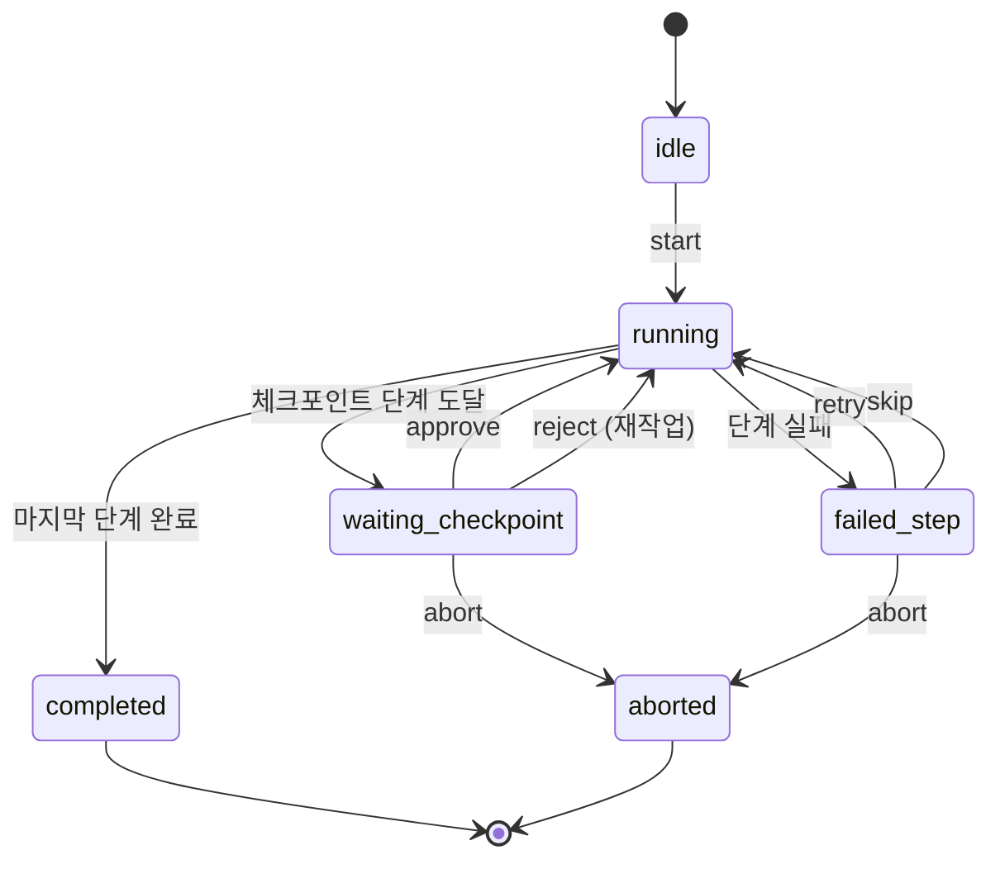

### 5개 파이프라인 비교

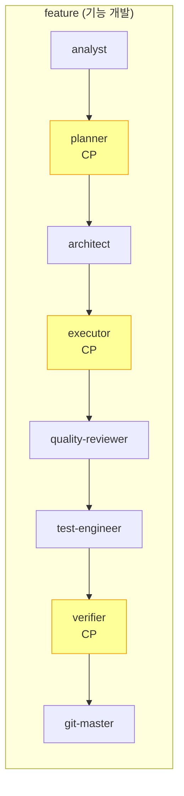

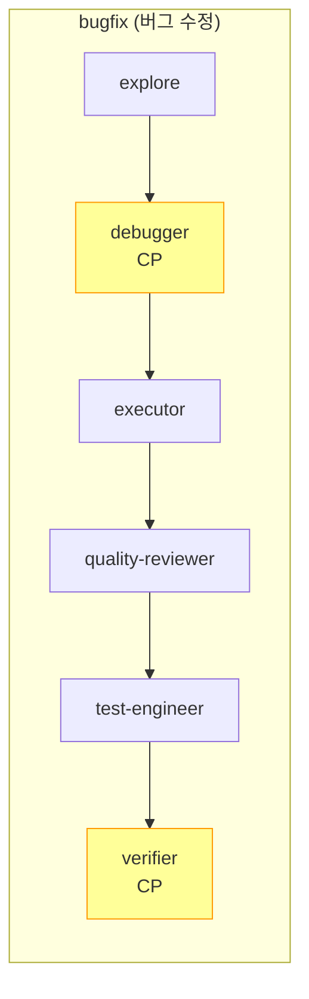

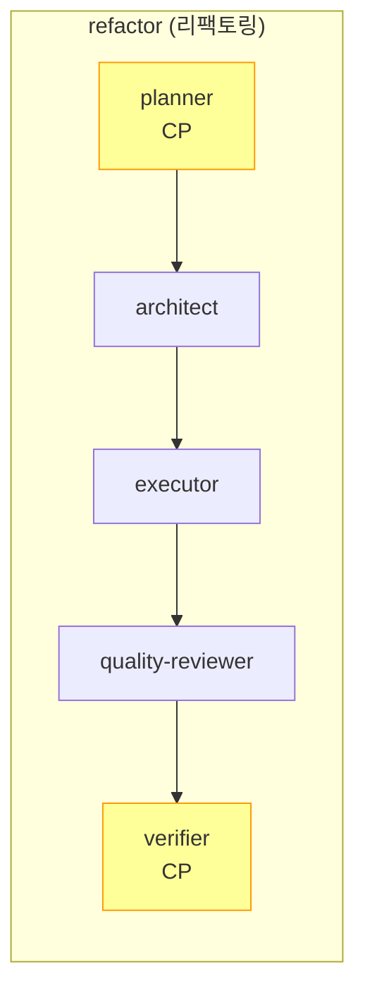

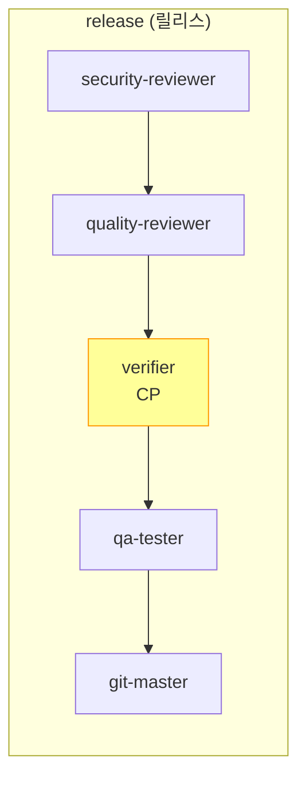

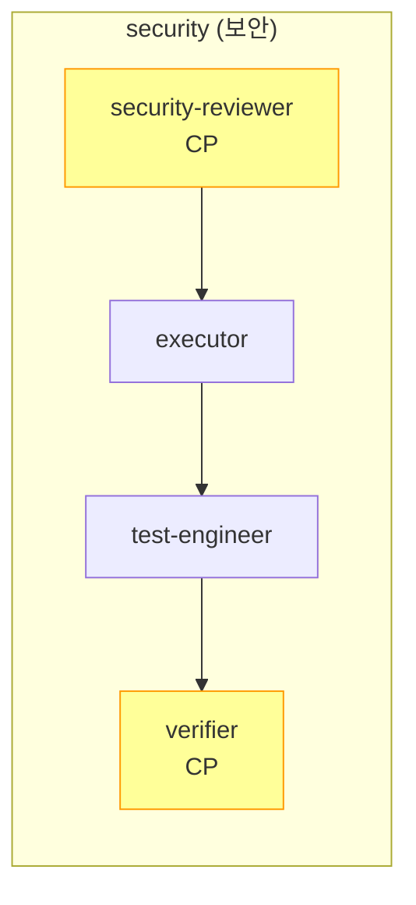

> **CP** (노란색) = 체크포인트 — 사용자 `approve` / `reject` 필요

### 에이전트 → OMC 스킬 매핑

| 파이프라인 에이전트 | OMC 스킬 | 역할 |
|-------------------|---------|------|
| analyst | `/oh-my-claudecode:analyze` | 요구사항 분석, 영향 범위 파악 |
| planner | `/oh-my-claudecode:plan` | SPARC 계획 수립 |
| architect | - | 아키텍처 리뷰/설계 |
| executor | `/oh-my-claudecode:autopilot` | 코드 구현 |
| test-engineer | `/oh-my-claudecode:tdd` | 테스트 작성/실행 |
| quality-reviewer | `/oh-my-claudecode:code-review` | TRUST 5 코드 리뷰 |
| security-reviewer | `/oh-my-claudecode:security-review` | OWASP 보안 검토 |
| verifier | - | 통합 검증 |
| git-master | - | 커밋/PR/태깅 |
| qa-tester | - | QA 테스트 실행 |
| explore | - | 탐색/디버깅 |
| debugger | - | 근본 원인 분석 |

---

## 라이프사이클 훅

### 전체 이벤트 흐름

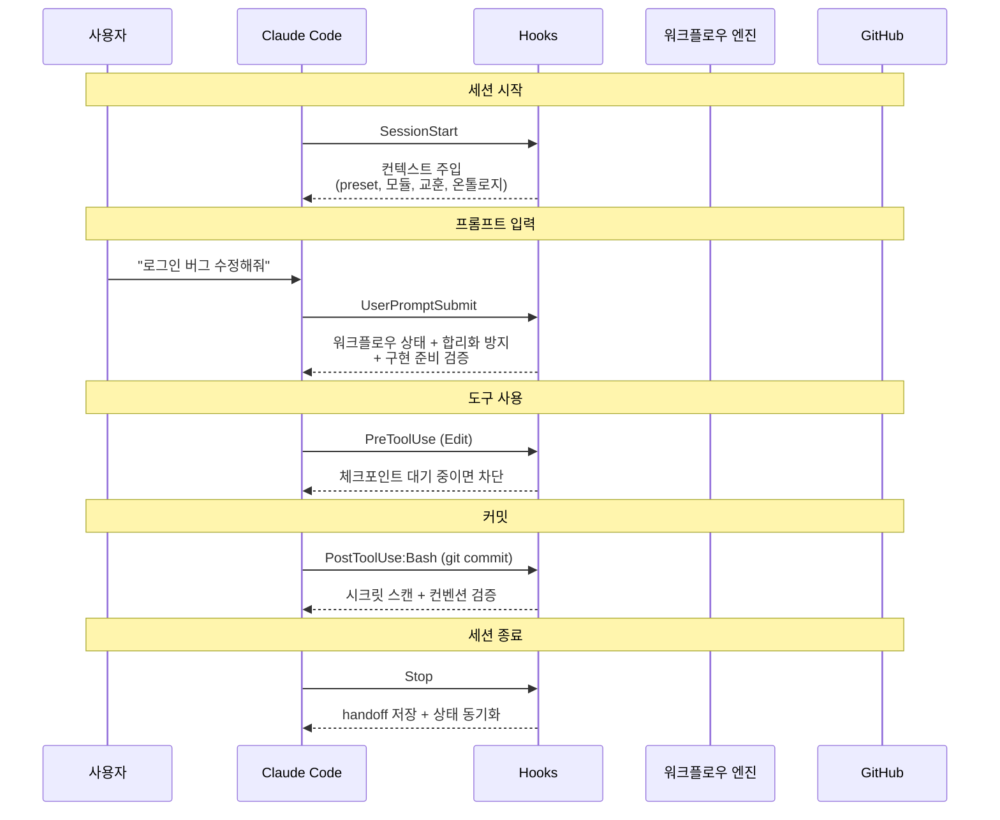

### 훅별 상세

| 이벤트 | 훅 | 타임아웃 | 핵심 동작 |
|--------|-----|---------|----------|
| SessionStart | session-start | 5s | 프로젝트 상태 + 교훈 + handoff + 온톨로지 요약 + 업데이트 알림 (4KB 예산) |
| UserPromptSubmit | prompt-enricher | 3s | Knowledge Vault + 워크플로우 컨텍스트 + 합리화 방지 + 적신호 탐지 |
| PreToolUse | workflow-guard | 3s | 체크포인트 대기 중 Edit/Write 차단, 워크플로우 상태 주입 |
| PostToolUse:Bash | quality-gate | 10s | `git commit` 감지 → 시크릿 스캔 + 브랜치 컨벤션 + 커밋 메시지 검증 |
| SubagentStart | subagent-context | 3s | 서브에이전트에 컨텍스트 전달 |
| PostToolUse:harness_* | event-logger | 3s | 도구 이벤트 로깅 (대시보드 소스) |
| PostToolUse:Task | remember-handler | 3s | 작업 완료 시 팀 메모리 자동 기록 |
| PostToolUseFailure | tool-failure-tracker | 3s | 도구 실패 추적 |
| SubagentStop | subagent-complete | 5s | 서브에이전트 결과 처리 |
| PreCompact | pre-compact | 5s | 컨텍스트 압축 전 정보 보존 |
| Stop | session-end | 5s | 상태 저장 + handoff + OMC 동기화 + 활성 모드 처리 |

---

## 스킬 (Slash Commands) — 12개

### 스킬 카테고리 맵

```
┌──────────────────────────────────────────────────────────────┐
│                     작업 라이프사이클                          │
│                                                              │
│   ┌──────────┐   ┌──────────┐   ┌──────────┐               │
│   │work-start│──▶│plan-gate │──▶│workflow  │               │
│   │작업 시작  │   │계획 수립  │   │단계 진행  │               │
│   └──────────┘   └──────────┘   └──────────┘               │
│        │                              │                      │
│        │                              ▼                      │
│        │              ┌──────────┐ ┌──────────┐             │
│        │              │verify-all│ │work-     │             │
│        │              │통합 검증  │ │finish    │             │
│        │              └──────────┘ │작업 마무리│             │
│        │                           └──────────┘             │
│        │                              │                      │
│        │                              ▼                      │
│        │                        ┌──────────┐                │
│        └───────────────────────▶│branch-   │                │
│                                 │cleanup   │                │
│                                 │브랜치 정리│                │
│                                 └──────────┘                │
├──────────────────────────────────────────────────────────────┤
│                     환경 관리                                 │
│                                                              │
│   ┌──────────┐ ┌──────────┐ ┌──────────┐ ┌──────────┐     │
│   │ setup    │ │  sync    │ │ doctor   │ │ scaffold │     │
│   │ 설치     │ │ 동기화   │ │ 진단     │ │ PRD 세팅 │     │
│   └──────────┘ └──────────┘ └──────────┘ └──────────┘     │
├──────────────────────────────────────────────────────────────┤
│                     도구                                      │
│                                                              │
│   ┌──────────┐ ┌──────────────┐                             │
│   │ ontology │ │ design-guide │                             │
│   │ 온톨로지 │ │ 디자인 시스템│                             │
│   └──────────┘ └──────────────┘                             │
└──────────────────────────────────────────────────────────────┘
```

### 스킬 상세

| # | 스킬 | 트리거 | 인자 예시 | 핵심 동작 |
|---|------|--------|----------|----------|
| 1 | **work-start** | `/carpdm-harness:work-start` | `feat/#123 로그인`, `fix #42` | 인터뷰 → 브랜치 생성 → KV 초기화 → 워크플로우 시작 |
| 2 | **work-finish** | `/carpdm-harness:work-finish` | - | 품질 검증 → KV 아카이브 → PR 생성 → 상태 갱신 |
| 3 | **workflow** | `/carpdm-harness:workflow` | `start`, `advance`, `status` | 워크플로우 FSM 조작 (가이드/시작/진행/승인/거부) |
| 4 | **plan-gate** | `/carpdm-harness:plan-gate` | `"사용자 프로필 페이지"` | SPARC 인터뷰 → plan.md + todo.md 생성 |
| 5 | **setup** | `/carpdm-harness:setup` | `standard`, `dry-run` | 환경 진단 → 프리셋 추천 → harness_init |
| 6 | **sync** | `/carpdm-harness:sync` | `dry-run`, `플러그인만` | 플러그인 업데이트 + 템플릿 동기화 |
| 7 | **verify-all** | `/carpdm-harness:verify-all` | `verbose`, `trust only` | TRUST 5 + 커스텀 verify 통합 |
| 8 | **doctor** | `/carpdm-harness:doctor` | - | 설치/모듈/외부도구 건강 진단 |
| 9 | **ontology** | `/carpdm-harness:ontology` | `generate`, `refresh` | 3계층 온톨로지 생성/갱신 |
| 10 | **scaffold** | `/carpdm-harness:scaffold` | PRD 파일 경로 | PRD 분석 → 설치 → CLAUDE.md/conventions.md 초안 |
| 11 | **branch-cleanup** | `/carpdm-harness:branch-cleanup` | - | main 전환 → 병합된 브랜치 정리 |
| 12 | **design-guide** | `/carpdm-harness:design-guide` | `MUI`, `Carbon`, `추천` | 디자인 시스템 설치/토큰/컴포넌트 레퍼런스 |

---

## MCP 도구 (harness_*) — 23개

### 도구 카테고리

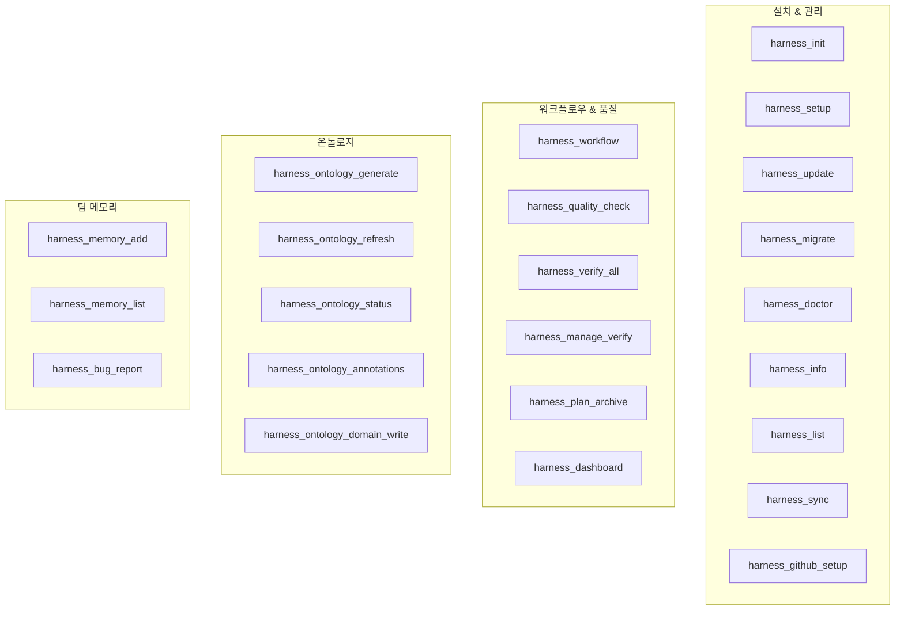

### 전체 도구 목록

| # | 도구 | 핵심 파라미터 | 목적 |
|---|------|-------------|------|
| 1 | `harness_init` | preset, modules, enableOntology | 프로젝트에 워크플로우 최초 설치 |
| 2 | `harness_setup` | preset, dryRun | 설치 전 환경 진단 + 프리셋 추천 |
| 3 | `harness_update` | module, acceptAll, refreshOntology | diff 기반 템플릿 업데이트 |
| 4 | `harness_migrate` | source, dryRun, keepOld | v3 → v4 마이그레이션 |
| 5 | `harness_doctor` | - | 설치 건강 종합 진단 |
| 6 | `harness_info` | - | 설치 상태 간략 조회 |
| 7 | `harness_list` | - | 모듈/프리셋 목록 |
| 8 | `harness_workflow` | action, workflow, result, reason | **FSM 엔진** (12개 action) |
| 9 | `harness_quality_check` | files, criteria, verbose | TRUST 5 수동 실행 |
| 10 | `harness_verify_all` | files, skipTrust, skipCustom | 통합 검증 |
| 11 | `harness_manage_verify` | action (analyze/apply) | 커스텀 verify 스킬 관리 |
| 12 | `harness_sync` | direction (full/harness-to-omc/...) | harness ↔ OMC 상태 동기화 |
| 13 | `harness_memory_add` | category, title, content, evidence | 팀 메모리 항목 추가 |
| 14 | `harness_memory_list` | category, status, severity | 팀 메모리 조회 |
| 15 | `harness_bug_report` | title, severity, createGithubIssue | 버그 기록 + GitHub Issue |
| 16 | `harness_dashboard` | sessionId, open | HTML 대시보드 생성 |
| 17 | `harness_ontology_generate` | layer, dryRun | 3계층 온톨로지 전체 생성 |
| 18 | `harness_ontology_refresh` | dryRun | 온톨로지 점진적 갱신 |
| 19 | `harness_ontology_status` | - | 온톨로지 상태 확인 |
| 20 | `harness_ontology_annotations` | tag, file, minFanIn | @MX 어노테이션 조회 |
| 21 | `harness_ontology_domain_write` | (도메인 데이터) | Domain 레이어 직접 작성 |
| 22 | `harness_plan_archive` | action (archive/list/restore) | plan.md 아카이브/복원 |
| 23 | `harness_github_setup` | - | GitHub 라벨 자동 생성 |

---

## 에이전트 — 8개 (+1)

### 에이전트 활용 맵

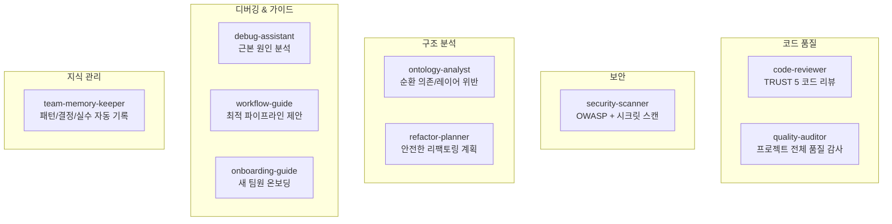

| 에이전트 | 활용 시점 | 핵심 동작 |
|---------|----------|----------|
| **code-reviewer** | PR 전 코드 리뷰 | TRUST 5 + @MX ANCHOR 기반, BLOCK/WARN/INFO 3단계 |
| **quality-auditor** | 주기적 품질 점검 | TRUST 5 상세 분석 + 기술 부채 Top 5 + 개선 로드맵 |
| **security-scanner** | 보안 감사 | OWASP Top 10 + 시크릿 + `npm audit` |
| **ontology-analyst** | 아키텍처 분석 | 순환 의존, 레이어 위반, 리팩토링 우선순위 |
| **refactor-planner** | 리팩토링 계획 | @MX ANCHOR 영향 범위 → 점진적 단계 계획 |
| **debug-assistant** | 버그 원인 분석 | 스택 트레이스 + 온톨로지 의존 관계 + 유사 버그 참조 |
| **workflow-guide** | 워크플로우 선택 | capabilities 기반 최적 OMC 파이프라인 제안 |
| **onboarding-guide** | 새 팀원 합류 | doctor → 온톨로지 → 팀 메모리 → 워크플로우 안내 |
| **team-memory-keeper** | 세션 중 자동 | 패턴/컨벤션/결정/실수 감지 → 자동 기록 |

---

## 온톨로지 시스템

### 3계층 구조

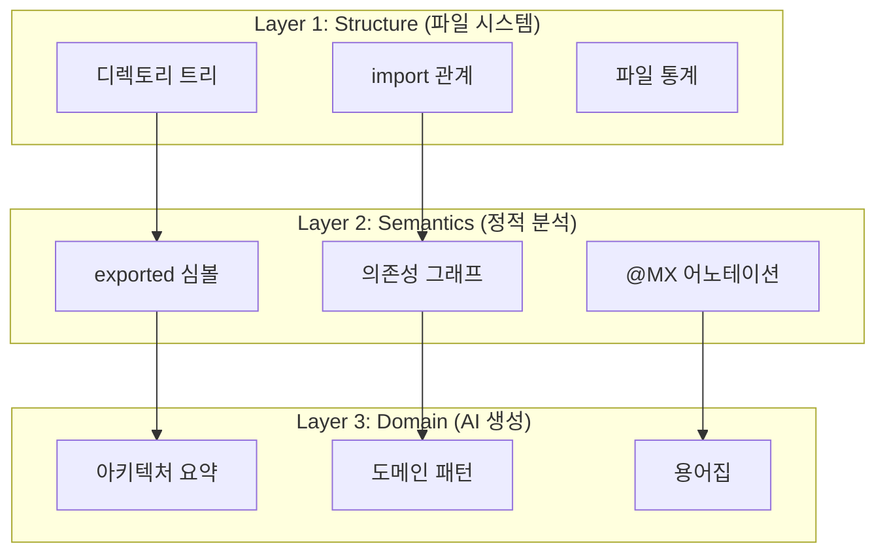

### @MX 어노테이션

| 태그 | 자동 분류 기준 | 의미 | 활용 |
|------|-------------|------|------|
| `@MX:ANCHOR` | fan_in >= 3 | 핵심 심볼 (많은 곳에서 참조) | 변경 전 영향 범위 반드시 분석 |
| `@MX:WARN` | 높은 복잡도 | 리팩토링 후보 | 품질 개선 대상 |
| `@MX:TODO` | 코드 내 TODO | 미완성 작업 | 기술 부채 추적 |
| `@MX:NOTE` | 수동 주석 | 설계 의도 | 지식 보존 |

### 온톨로지 갱신 흐름

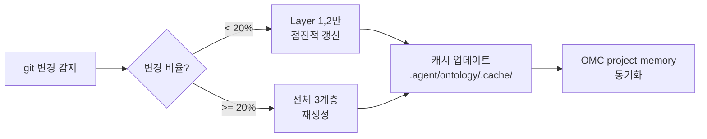

---

## 팀 메모리 시스템

### 저장 구조

```
.claude/rules/              ← Git 추적, 팀 공유
├── conventions.md          ← 코딩 컨벤션 (naming/structure/error-handling)
├── patterns.md             ← 반복 코드 패턴
├── decisions.md            ← 아키텍처 결정 기록 (ADR)
├── mistakes.md             ← 팀 실수 & 교훈
└── bugs.md                 ← 버그 추적

.agent/memory.md            ← 에이전트용 통합 메모리
.harness/team-memory.json   ← 기계 가독형 저장소
```

### OMC 동기화 매핑

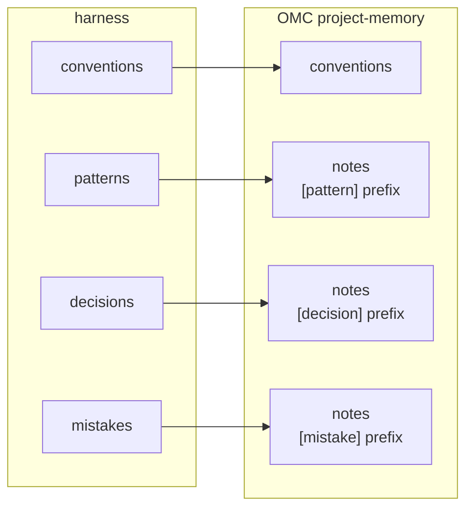

---

## 실전 시나리오

---

### 시나리오 1: 신규 프로젝트 온보딩 (Next.js 쇼핑몰)

> **상황**: Next.js + TypeScript 기반 쇼핑몰 프로젝트를 시작하며 harness를 처음 설치

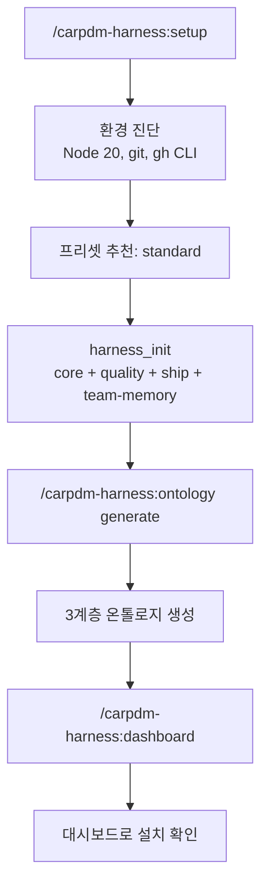

**실제 대화 예시**:

```
사용자: /carpdm-harness:setup

AI: [진행중] 프로젝트 환경을 진단합니다...

환경 진단 결과:
- Node.js: v20.11.0 ✅
- Git: 2.43.0 ✅
- gh CLI: 2.42.0 ✅
- OMC: v2.1.0 ✅
- Serena: 미감지 (선택적)
- Context7: 감지됨 ✅

프리셋 추천: standard (core + quality + ship + team-memory)
- 일반 웹 프로젝트에 최적
- TDD 모듈은 나중에 추가 가능

설치를 진행할까요?

사용자: 네, 온톨로지도 같이 활성화해주세요

AI: harness_init({
  projectRoot: "/Users/dev/my-shop",
  preset: "standard",
  enableOntology: true,
  ontologyLanguages: "typescript"
})

[완료] 설치 완료!
- 설치된 모듈: core, quality, ship, team-memory
- 생성된 파일: 34개 (commands 30, hooks 6, docs 8, rules 5)
- 온톨로지: 3계층 생성 중...

[완료] 온톨로지 생성 완료
- Structure: 47개 파일, 12개 디렉토리
- Semantics: 128개 심볼, @MX:ANCHOR 8개
- Domain: AI 분석 완료 (e-commerce 도메인)

다음 단계:
1. /carpdm-harness:doctor  — 설치 검증
2. /carpdm-harness:scaffold — CLAUDE.md 초안 생성
3. /carpdm-harness:work-start — 첫 작업 시작
```

---

### 시나리오 2: 기능 개발 — 사용자 프로필 페이지

> **상황**: 쇼핑몰에 사용자 프로필 페이지를 추가

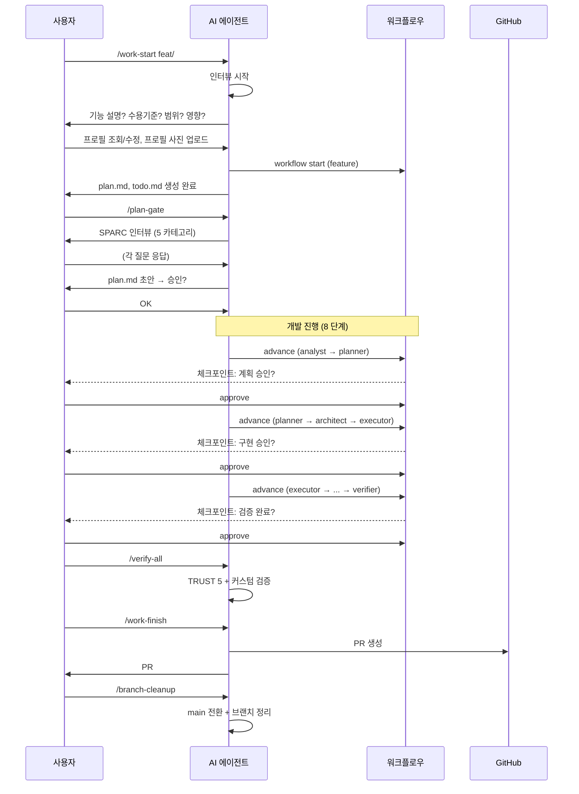

**실제 대화 예시**:

```
사용자: /carpdm-harness:work-start feat/#23 사용자 프로필 페이지

AI: [진행중] 작업 유형: feature 감지

📋 컨텍스트 수집 인터뷰

1/5 기능 설명: 어떤 기능을 구현하나요?

사용자: 사용자가 자신의 프로필을 조회/수정하고, 프로필 사진을 업로드할 수 있는 페이지

AI: 2/5 수용 기준: 완료 조건은?

사용자:
- 이름, 이메일, 전화번호 수정 가능
- 프로필 사진 업로드 (최대 5MB, jpg/png)
- 비밀번호 변경은 별도 페이지

AI: 3/5 범위: 영향받는 컴포넌트/파일은?

사용자: pages/, components/profile/, api/user/

AI: 4/5 기술적 제약사항?

사용자: S3 업로드, 이미지 리사이징은 sharp 사용

AI: 5/5 리스크?

사용자: 이미지 업로드 실패 시 UX, 대용량 파일 처리

AI: [완료] 인터뷰 완료

- git checkout -b feat/23-user-profile ✅
- .knowledge/branches/feat/23-user-profile/ 초기화 ✅
- harness_workflow start (feature) ✅

생성된 파일:
- .agent/plan.md (DRAFT)
- .agent/todo.md (7단계)
- .knowledge/branches/feat/23-user-profile/spec.md

다음 단계: /carpdm-harness:plan-gate 로 상세 계획을 수립하세요.
```

---

### 시나리오 3: 버그 수정 — 결제 API 500 에러

> **상황**: 프로덕션에서 특정 상품 결제 시 500 에러 발생

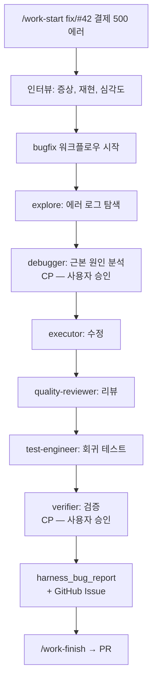

**실제 대화 예시**:

```
사용자: /carpdm-harness:work-start fix/#42 결제 API 500 에러

AI: [진행중] 작업 유형: bugfix 감지

📋 버그 컨텍스트 수집

1/4 증상: 어떤 에러가 발생하나요?

사용자: POST /api/checkout에서 특정 상품(할인 적용 상품)만 500 에러

AI: 2/4 재현 방법?

사용자: 할인율 100% 상품을 장바구니에 넣고 결제 → division by zero

AI: 3/4 기대 동작?

사용자: 할인율 100%면 금액 0원으로 처리되어야 함

AI: 4/4 심각도?

사용자: critical — 프로덕션 영향

AI: [완료] critical 심각도 — 인터뷰 최소화 완료

- git checkout -b fix/42-checkout-500 ✅
- bugfix 워크플로우 시작 ✅

현재 단계: explore (탐색)

harness_ontology_annotations로 @MX:ANCHOR 확인 중...
→ checkout.service.ts (fan_in: 7) — 핵심 모듈

[진행중] 에러 원인 분석...

근본 원인 발견:
- src/services/checkout.service.ts:142
- `const unitPrice = totalPrice / discountedQuantity`
- discountedQuantity가 0일 때 division by zero

수정 방안: discountedQuantity === 0이면 unitPrice = 0으로 처리

harness_workflow({ action: "advance", result: "root cause identified" })

[체크포인트] 원인 분석 결과를 승인하시겠습니까?
- approve: 수정 진행
- reject: 재분석

사용자: approve

AI: [진행중] 수정 중...
(코드 수정 + 테스트 추가)

[완료] 수정 및 테스트 완료

harness_bug_report({
  title: "할인율 100% 상품 결제 시 division by zero",
  severity: "critical",
  rootCause: "checkout.service.ts:142 — discountedQuantity 0 체크 누락",
  resolution: "0 체크 가드 추가 + 단위 테스트",
  affectedFiles: ["src/services/checkout.service.ts"],
  createGithubIssue: true
})

[기록] 버그 기록 + GitHub Issue #42 업데이트 완료

/carpdm-harness:verify-all 실행하시겠습니까?
```

---

### 시나리오 4: 리팩토링 — 인증 모듈 분리

> **상황**: 모놀리식 auth.ts를 역할별 모듈로 분리

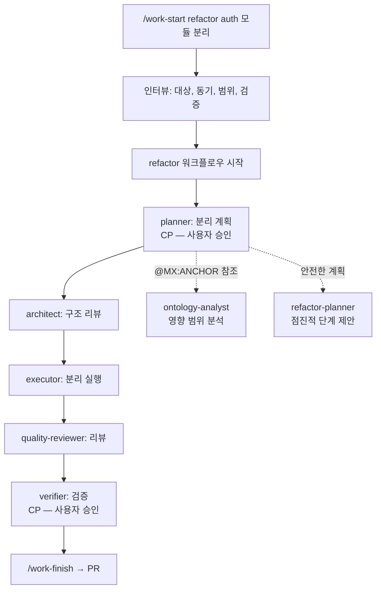

**실제 대화 예시**:

```
사용자: /carpdm-harness:work-start refactor auth 모듈 분리

AI: [진행중] 작업 유형: refactor 감지

📋 리팩토링 컨텍스트 수집

1/4 대상: 어떤 코드를 리팩토링하나요?

사용자: src/auth.ts — 800줄짜리 모놀리식 파일

AI: 2/4 동기?

사용자: 단일 책임 원칙 위반, 테스트 어려움, JWT/OAuth/Session 로직 혼재

AI: 3/4 범위?

사용자: auth.ts → auth/jwt.ts, auth/oauth.ts, auth/session.ts, auth/index.ts

AI: 4/4 검증 방법?

사용자: 기존 테스트 전부 통과 + import 경로 호환

AI: [완료] refactor 워크플로우 시작

harness_ontology_annotations로 영향 분석:
- auth.ts: @MX:ANCHOR (fan_in: 12) — 12개 파일에서 참조
- 참조 파일: middleware/auth.ts, pages/login.tsx, api/*.ts ...

⚠️ fan_in 12 — 영향 범위가 넓습니다. 점진적 리팩토링을 권장합니다.

refactor-planner 에이전트 제안:
1단계: auth/index.ts에서 기존 export 유지 (하위호환)
2단계: JWT 로직 분리 → auth/jwt.ts
3단계: OAuth 로직 분리 → auth/oauth.ts
4단계: Session 로직 분리 → auth/session.ts
5단계: 참조 파일 12개 import 경로 업데이트
6단계: auth/index.ts에서 re-export 제거

[체크포인트] 이 계획을 승인하시겠습니까?
```

---

### 시나리오 5: 릴리스 — v2.0.0

> **상황**: 메이저 릴리스 준비

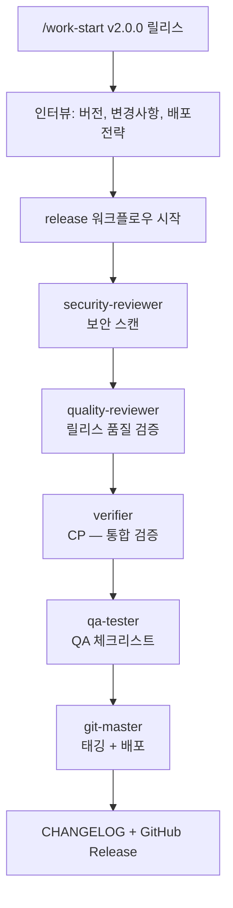

**실제 대화 예시**:

```
사용자: /carpdm-harness:work-start v2.0.0 릴리스

AI: [진행중] 작업 유형: release 감지

📋 릴리스 컨텍스트 수집

1/3 버전: 릴리스 버전은?

사용자: v2.0.0 (메이저 — breaking changes 포함)

AI: 2/3 주요 변경사항?

사용자:
- 인증 모듈 구조 변경 (import 경로)
- API v2 엔드포인트 추가
- Node 18 지원 종료

AI: 3/3 배포 전략?

사용자: staging 배포 후 1일 모니터링 → production

AI: [완료] release 워크플로우 시작

[진행중] Phase 1: 보안 검토
security-scanner 에이전트 실행 중...
→ npm audit: 0 vulnerabilities ✅
→ 시크릿 스캔: clean ✅
→ OWASP: 이슈 없음 ✅

[진행중] Phase 2: 릴리스 품질 검증
/verify-all 실행 중...
→ TRUST 5: T(98) R(95) U(92) S(100) T(97) = 96.4점 ✅

[체크포인트] 통합 검증 결과:
- 보안: PASS
- 품질: 96.4/100
- 테스트: 142/142 통과
- Breaking changes 문서화: ✅

릴리스를 진행하시겠습니까?

사용자: approve

AI: [진행중] Phase 4: QA 체크리스트 실행...
[진행중] Phase 5: 태깅 + CHANGELOG 생성...

git tag v2.0.0
CHANGELOG.md 업데이트 완료
GitHub Release 생성: https://github.com/org/my-shop/releases/tag/v2.0.0

[완료] v2.0.0 릴리스 완료!
```

---

### 시나리오 6: 팀 지식 관리

> **상황**: 코드 리뷰 중 발견한 패턴과 결정사항을 팀 메모리에 기록

```mermaid
graph LR
    A["패턴 발견"] --> B["harness_memory_add<br/>category: patterns"]
    C["아키텍처 결정"] --> D["harness_memory_add<br/>category: decisions"]
    E["실수 발생"] --> F["harness_memory_add<br/>category: mistakes"]
    G["버그 발견"] --> H["harness_bug_report<br/>+ GitHub Issue"]

    B --> I[".claude/rules/<br/>Git 추적"]
    D --> I
    F --> I
    H --> I

    I --> J["harness_sync<br/>OMC 동기화"]
    J --> K["모든 AI 에이전트가<br/>다음 세션부터 참조"]
```

**실제 대화 예시**:

```
사용자: 이번에 결정한 API 에러 형식을 팀 메모리에 기록해줘

AI: harness_memory_add({
  category: "decisions",
  title: "API 에러 응답 표준 형식 채택",
  content: "RFC 7807 Problem Details 형식 사용. { type, title, status, detail, instance } 필드 포함. 모든 API 에러 핸들러에서 이 형식 준수.",
  evidence: ["src/middleware/error-handler.ts", "docs/api-spec.md"]
})

[기록] 아키텍처 결정 기록 완료
- .claude/rules/decisions.md 업데이트
- .agent/memory.md 동기화
- OMC project-memory 동기화

→ 다음 세션부터 모든 AI 에이전트가 이 결정을 참조합니다.

사용자: 아까 발생한 N+1 쿼리 실수도 기록해

AI: harness_memory_add({
  category: "mistakes",
  title: "Product 목록 조회 N+1 쿼리 문제",
  content: "Product.find()에서 Category를 eager loading 없이 조회하여 N+1 발생. 해결: populate('category') 추가. 교훈: 관계 데이터 조회 시 항상 include/populate 확인.",
  evidence: ["src/repositories/product.repository.ts"]
})

[기록] 실수 & 교훈 기록 완료
→ 같은 실수를 반복하지 않도록 다음 세션부터 경고합니다.
```

---

### 시나리오 7: 보안 이슈 긴급 패치

> **상황**: CVE가 보고된 의존성 취약점 긴급 패치

```mermaid
graph TD
    A["/work-start security CVE-2024-1234"] --> B["인터뷰: 이슈, 심각도, 긴급도"]
    B --> C["security 워크플로우 시작"]
    C --> D["security-reviewer<br/>CP — 취약점 스캔"]
    D --> E["executor: 패치 적용"]
    E --> F["test-engineer: 보안 테스트"]
    F --> G["verifier<br/>CP — 보안 검증"]
    G --> H["긴급 PR + 핫픽스 배포"]

    style A fill:#f99,stroke:#f00
    style D fill:#f99,stroke:#f00
    style H fill:#f99,stroke:#f00
```

**실제 대화 예시**:

```
사용자: /carpdm-harness:work-start security CVE-2024-1234 jsonwebtoken 취약점

AI: [진행중] 작업 유형: security 감지

📋 보안 컨텍스트 수집 (긴급 — 최소 인터뷰)

1/3 이슈: CVE-2024-1234 — jsonwebtoken <9.0.0에서 JWT 위조 가능
2/3 심각도: critical
3/3 긴급도: high — 프로덕션 영향

- git checkout -b security/cve-2024-1234 ✅
- security 워크플로우 시작 ✅

[진행중] Phase 1: 취약점 스캔

security-scanner 실행 결과:
- jsonwebtoken@8.5.1 → 취약 ✅ (CVE-2024-1234)
- 영향 파일: src/auth/jwt.ts, src/middleware/auth.ts
- npm audit: 1 critical vulnerability

[체크포인트] 취약점 확인. 패치를 진행하시겠습니까?
- 권장: jsonwebtoken@9.0.2로 업그레이드

사용자: approve

AI: [진행중] Phase 2: 패치 적용
- package.json: jsonwebtoken ^8.5.1 → ^9.0.2
- npm install 실행
- Breaking changes 확인: verify() 시그니처 변경 → 코드 수정 필요

[진행중] Phase 3: 보안 테스트
- JWT 생성/검증 테스트: 12/12 통과 ✅
- 위조 JWT 거부 테스트: 추가 + 통과 ✅

[체크포인트] 보안 검증 완료. PR 생성?

사용자: approve, 긴급이니 바로 PR 올려줘

AI: /carpdm-harness:work-finish

harness_bug_report({
  title: "CVE-2024-1234: jsonwebtoken JWT 위조 취약점",
  severity: "critical",
  resolution: "jsonwebtoken 9.0.2로 업그레이드",
  createGithubIssue: true
})

[완료] PR #31 생성: "fix(security): upgrade jsonwebtoken to 9.0.2 (CVE-2024-1234)"
→ https://github.com/org/my-shop/pull/31
```

---

## 파일 시스템 구조 (설치 후)

설치 후 프로젝트에 생성되는 전체 디렉토리 구조:

```
my-project/
├── .agent/                          ← AI 에이전트 작업 공간
│   ├── plan.md                      ← 현재 작업 계획 (SPARC)
│   ├── todo.md                      ← 작업 목록 (← CURRENT 마커)
│   ├── context.md                   ← 도메인 컨텍스트
│   ├── lessons.md                   ← 교훈 기록
│   ├── memory.md                    ← 통합 메모리
│   ├── handoff.md                   ← 세션 인수인계
│   ├── session-log.md               ← 세션 로그
│   ├── plans-archive/               ← 과거 계획 아카이브
│   └── ontology/                    ← 3계층 온톨로지
│       ├── ONTOLOGY-STRUCTURE.md
│       ├── ONTOLOGY-SEMANTICS.md
│       ├── ONTOLOGY-DOMAIN.md
│       └── .cache/
│
├── .claude/
│   ├── settings.local.json          ← 권한/훅 설정
│   ├── commands/                    ← 설치된 스킬 (30+)
│   ├── rules/                       ← 팀 메모리 규칙
│   │   ├── conventions.md
│   │   ├── patterns.md
│   │   ├── decisions.md
│   │   ├── mistakes.md
│   │   └── bugs.md
│   └── agents/                      ← 서브에이전트 정의
│
├── .harness/
│   ├── state/                       ← 워크플로우 상태
│   │   └── current-work.json
│   ├── workflows/                   ← FSM 상태/히스토리
│   │   ├── active.json
│   │   └── <workflow-id>/
│   ├── cache/                       ← 온톨로지/브랜치 캐시
│   ├── capabilities.json            ← 외부 도구 캐시
│   ├── team-memory.json             ← 기계 가독형 메모리
│   ├── update-check.json            ← 업데이트 캐시
│   └── dashboard.html               ← 대시보드
│
├── .knowledge/                      ← Knowledge Vault
│   ├── branches/
│   │   ├── <branch-name>/
│   │   │   ├── spec.md
│   │   │   ├── design.md
│   │   │   ├── decisions.md
│   │   │   └── notes.md
│   │   └── _archive/
│   └── ontology/                    ← 온톨로지 동기화
│
├── docs/templates/                  ← 문서 템플릿
│   ├── plan-template.md
│   ├── sdd-template.md
│   ├── ontology-guide.md
│   └── ...
│
├── carpdm-harness.config.json       ← 플러그인 설정
└── hooks/hooks.json                 ← 훅 이벤트 매핑
```

---

## TRUST 5 품질 기준

```
    T         R         U         S         T
  Tested   Readable  Unified   Secured  Trackable
    │         │         │         │         │
    ▼         ▼         ▼         ▼         ▼
 ┌──────┐ ┌──────┐ ┌──────┐ ┌──────┐ ┌──────┐
 │테스트 │ │함수   │ │코드   │ │시크릿 │ │커밋   │
 │파일   │ │길이   │ │스타일 │ │노출   │ │컨벤션 │
 │존재?  │ │네이밍 │ │일관성 │ │보안   │ │이슈   │
 │      │ │      │ │      │ │취약점 │ │참조   │
 └──────┘ └──────┘ └──────┘ └──────┘ └──────┘

 예시 출력:
 ╔═══════════════════════════════════════╗
 ║ TRUST 5 Quality Gate                 ║
 ╠═══════════════════════════════════════╣
 ║ T Tested     ████████████░░ 85%      ║
 ║ R Readable   ██████████████ 95%      ║
 ║ U Unified    █████████████░ 92%      ║
 ║ S Secured    ██████████████ 100%     ║
 ║ T Trackable  ███████████░░░ 80%      ║
 ╠═══════════════════════════════════════╣
 ║ Overall: 90.4 / 100  PASS           ║
 ╚═══════════════════════════════════════╝
```

---

## 빠른 참조 카드

### 자주 쓰는 명령어

| 작업 | 명령 |
|------|------|
| 설치 | `/carpdm-harness:setup` |
| 진단 | `/carpdm-harness:doctor` |
| 작업 시작 | `/carpdm-harness:work-start feat/#이슈번호 설명` |
| 계획 수립 | `/carpdm-harness:plan-gate` |
| 워크플로우 진행 | `/carpdm-harness:workflow advance` |
| 워크플로우 상태 | `/carpdm-harness:workflow status` |
| 체크포인트 승인 | `/carpdm-harness:workflow approve` |
| 통합 검증 | `/carpdm-harness:verify-all` |
| 작업 마무리 | `/carpdm-harness:work-finish` |
| 브랜치 정리 | `/carpdm-harness:branch-cleanup` |
| 온톨로지 갱신 | `/carpdm-harness:ontology refresh` |
| 동기화 | `/carpdm-harness:sync` |

### 작업 유형별 흐름

```
feature:  work-start → plan-gate → workflow(8단계) → verify-all → work-finish
bugfix:   work-start → workflow(6단계) → verify-all → work-finish
refactor: work-start → plan-gate → workflow(5단계) → verify-all → work-finish
release:  work-start → workflow(5단계) → work-finish
security: work-start → workflow(4단계) → verify-all → work-finish
```

---

## 수치 요약

| 항목 | 수량 |
|------|------|
| 스킬 (Slash Commands) | 12 |
| MCP 도구 (harness_*) | 23 |
| 라이프사이클 훅 | 11 |
| 에이전트 | 9 |
| 워크플로우 파이프라인 | 5 |
| 프리셋 | 4 |
| 모듈 | 7 |
| TRUST 5 품질 기준 | 5 |
| @MX 어노테이션 태그 | 4 |
| 팀 메모리 카테고리 | 5 |
